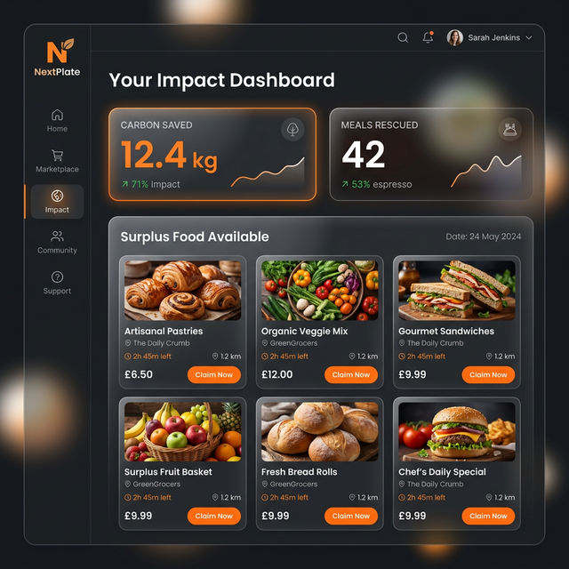
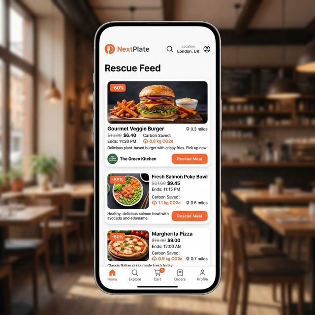
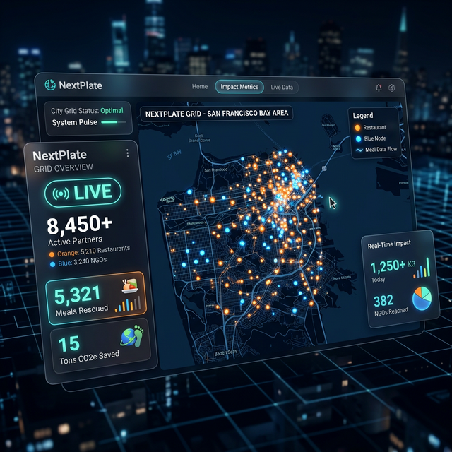
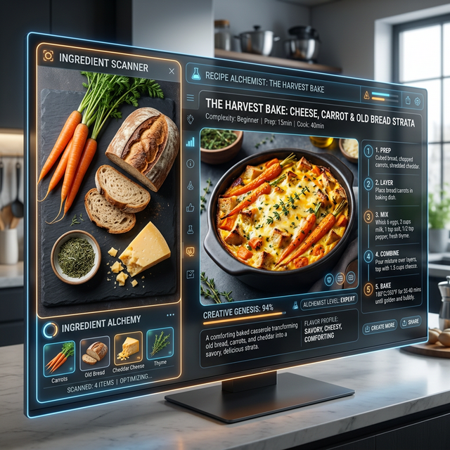

# 📸 NextPlate: Visual Showcase

Experience the platform's high-end interface and AI-powered capabilities.

## 🖥️ Platform Dashboard
The central command center for restaurants and admins. Monitoring carbon savings, real-time rescues, and grid health in a premium dark-themed environment.

## 📱 Mobile Rescue Feed
The consumer-facing PWA (Progressive Web App) allows users to scan for nearby surplus food packets, see their environmental impact, and execute a rescue mission.

## 🗺️ Live Impact Map
A macro-view of the NextPlate grid. Visualizing the massive collaborative effort between restaurants and NGOs in real-time.

## 🧪 AI Recipe Alchemist
Turning mismatched surplus ingredients into gourmet community meals. The Alchemist uses Gemini AI to ensure zero waste at the preparation level.

---
*All UI designs optimized for maximum accessibility and performance.*
